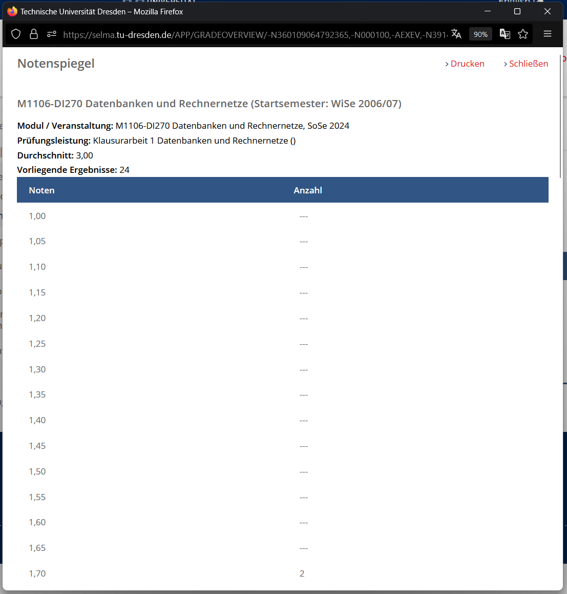
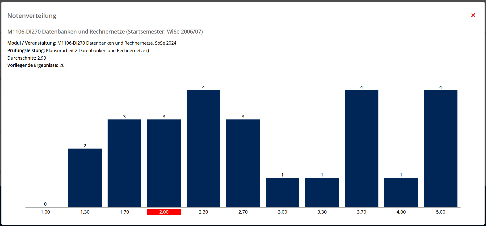

# selma-grades-plotter
selma-grades-plotter is a browser extension that poses an alternative to the grade 
distribution page on selma (used by TU Dresden). It adds the ability to display this information in a bar chart as a pop up. The chart is based on the exact information of the table.
### Before

### After

## Supported Browsers
This extension was primarily designed for firefox and not tested on any other browser.

## Installation
Download and install ([explained here](https://www.inflectra.com/Support/KnowledgeBase/KB359.aspx)) the .xpi file from the latest relase.

## Privacy
The application does not upload nor save any personal data. The only network interaction is fetching the grade distribution data from selma.tu-dresden.de.
